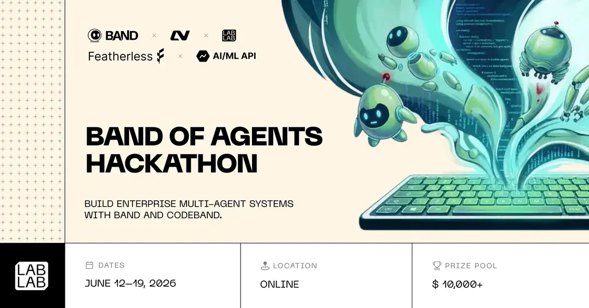
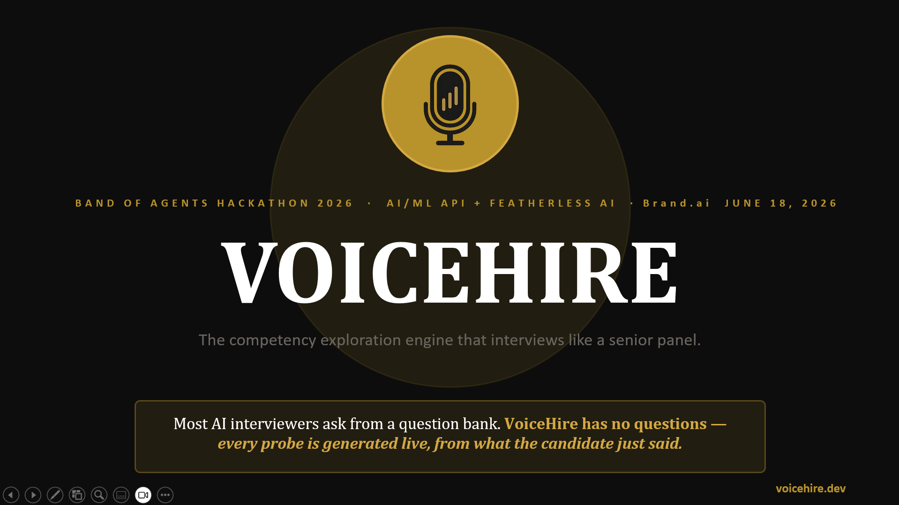

# VoiceHire — AI-Powered Interviewing Platform

> [](https://lablab.ai/ai-hackathons/band-of-agents-hackathon)

> Competency-Driven AI Interviews

**Features:** Job Posting Management · AI-Generated Descriptions · Resume Parsing · Multi-Agent Interviews · Real-Time Probes · Integrity Monitoring · Hiring Committee Deliberation · Analytics Dashboard · Candidate-Job AI Matching

---

## Quick Start (<5 minutes)

### Prerequisites

- Python 3.12+, Node.js 20+, npm 10+
- API keys: [AI/ML API](https://aimlapi.com), [Deepgram](https://deepgram.com), [Band.ai](https://app.band.ai)

### Setup

```bash
# 1. Clone and configure
git clone <repo-url> && cd voicehire
cp .env.example .env   # Fill in all API keys
python -c "import secrets; print(secrets.token_hex(32))"  # Set as JWT_SECRET

# 2. Install dependencies
pip install -r requirements.txt
cd frontend && npm install && cd ..

# 3. Register Band.ai agents (one-time)
python scripts/register_agents.py

# 4. Verify everything works
python scripts/smoke_test.py
python scripts/check_agents.py

# 5. Start development servers
python scripts/run_server.py          # Backend -> http://localhost:8000
cd frontend && npm run dev            # Frontend -> http://localhost:5173
```

### Key Commands

| Command | Purpose |
|---|---|
| `python scripts/run_server.py` | Start backend (uvicorn on :8000) |
| `cd frontend && npm run dev` | Start frontend (Vite on :5173) |
| `python scripts/register_agents.py` | Register 6 Band.ai agents (first setup) |
| `python scripts/smoke_test.py` | Verify all LLM endpoints |
| `pytest tests/` | Run 11 coverage map unit tests |
| `python scripts/stress_test.py` | 3-session stress test (Backend/ML/Manager) |
| `docker-compose up --build` | Run everything in containers |

---

## Architecture Overview

```
┌─────────────┐     ┌──────────────────────┐     ┌──────────────────┐
│  React SPA  │────▶│   FastAPI Backend     │────▶│  Band.ai Rooms   │
│  (Vite 5)   │◀────│   (uvicorn :8000)     │◀────│  (6 AI Agents)   │
└─────────────┘     └──────────────────────┘     └──────────────────┘
                           │         │                    │
                           ▼         ▼                    ▼
                     ┌──────────┐ ┌──────────────────────────────┐
                     │ SQLite   │ │ AI Services:                 │
                     │ (events) │ │ • Resume Parser (gpt-4o-mini)│
                     └──────────┘ │ • Job Generator (gpt-4o-mini)│
                                  │ • Candidate Matcher (gpt-4o-mini)│
                                  │ • Deepgram STT/TTS           │
                                  │ • AI/ML API + Featherless AI │
                                  └──────────────────────────────┘
```

For detailed architecture, agent roles, database schema, API reference, and deployment strategy:

➡️ **[SYSTEM_DESIGN.md](SYSTEM_DESIGN.md)**

---

## 📊 Pitch Deck

[](pitch_deck/VoiceHire.pdf)

---

## 🎥 Demo

<a href="https://youtu.be/b2X2ZTAZU3A">
  
</a>
