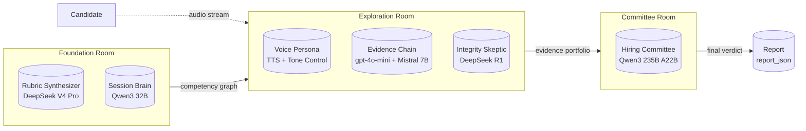
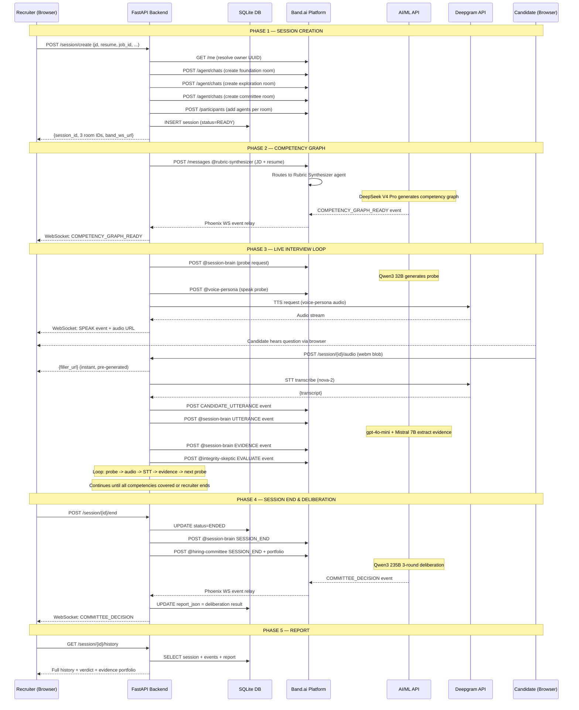
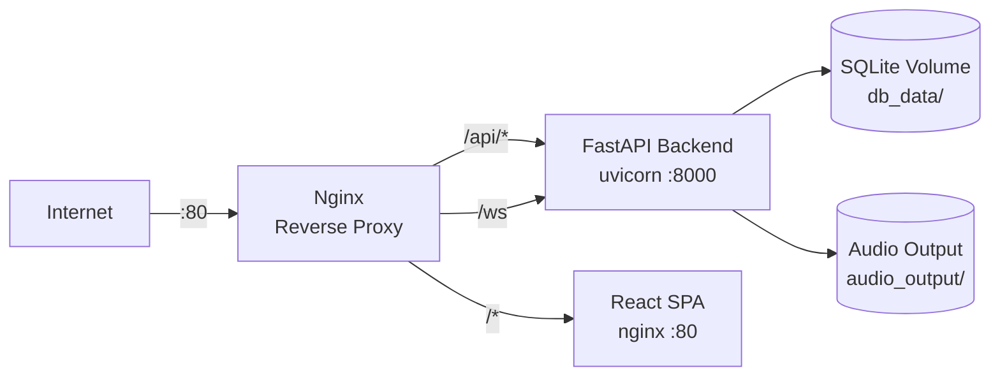

# VoiceHire — System Design & Architecture

> **Version:** 2.1 — Production-ready architecture document
> **Project:** Band of Agents Hackathon 2026 — Competency-Driven AI Interviewing
> **Last Updated:** June 2026

---

## Table of Contents

1. [Project Overview](#1-project-overview)
2. [Tech Stack & Frameworks](#2-tech-stack--frameworks)
3. [Installation & Setup Guide](#3-installation--setup-guide)
4. [System Architecture](#4-system-architecture)
5. [Multi-Agent System & Roles](#5-multi-agent-system--roles)
6. [Database Schema & Data Flow](#6-database-schema--data-flow)
7. [API Reference](#7-api-reference)
8. [Session Lifecycle Sequence](#8-session-lifecycle-sequence)
9. [Security & Integrity Features](#9-security--integrity-features)
10. [Resilience & Fallback Mechanisms](#10-resilience--fallback-mechanisms)
11. [Deployment Strategy](#11-deployment-strategy)

---

## 1. Project Overview

VoiceHire is an **AI-powered automated interviewing platform** that conducts competency-driven interviews using a multi-agent system. Unlike traditional interview tools with static question banks, VoiceHire dynamically generates probes based on a candidate's resume and job description, evaluates responses in real-time, and produces an evidence-backed hiring verdict.

### Key Value Propositions

- **Bias-Free Hiring** — Probes target demonstrable competencies, not gut feelings. The CoverageMap tracks coverage gaps deterministically — no LLM biases in scoring.
- **Evidence-Based Decisions** — Every competency verdict is backed by direct candidate quotes, tagged with confidence scores and behavioral signals. The Hiring Committee debates real evidence, not impressions.
- **Real-Time Integrity Monitoring** — A dedicated Integrity Skeptic agent monitors for cheating behaviors (tab switches, copy-paste) and adjusts evidence confidence accordingly.
- **Multi-Agent Deliberation** — Post-interview, three specialized personas (Advocate, Critic, Chair) debate the candidate's performance, mirroring real hiring committee dynamics.

---

## 2. Tech Stack & Frameworks

### 2.1 Backend

| Concern | Technology | Location |
|---------|-----------|----------|
| Runtime | Python 3.12 | `Dockerfile` — `python:3.12-slim` |
| Web framework | FastAPI | `voicehire/api/server.py` |
| ASGI server | uvicorn | `scripts/run_server.py` |
| Async ORM | SQLAlchemy 2.0 (async) + aiosqlite | `voicehire/db/database.py` |
| Database | SQLite 3 | `db_data/voicehire.db` |
| Auth | JWT (HS256, python-jose) | `voicehire/api/auth.py` |
| HTTP client | httpx (AsyncClient) | `voicehire/band/agent_base.py` |
| AI SDK | OpenAI Python SDK (AsyncOpenAI) | `voicehire/api/client.py` |
| Candidate Matcher | OpenAI GPT-4o-mini (batched ranking) | `voicehire/services/candidate_matcher.py` |
| WebSocket client | `websockets` library | `voicehire/band/event_listener.py` |
| Config | python-dotenv | `config.py` |
| CORS | FastAPI CORSMiddleware | `voicehire/api/server.py` |

### 2.2 Frontend

| Concern | Technology | Location |
|---------|-----------|----------|
| Framework | React 18 (functional + hooks) | `frontend/src/` |
| Language | TypeScript (strict) | `tsconfig.json` |
| Build tool | Vite 5 | `vite.config.ts` |
| Styling | Tailwind CSS v4 | `frontend/src/style.css` |
| Icons | lucide-react + tabler-icons | `package.json` |
| Charts | recharts | `AnalyticsView.tsx` |
| State management | Custom hooks (no Redux/Zustand) | `frontend/src/hooks/` |
| WebSocket | Native browser WebSocket API | `frontend/src/hooks/useBandSession.ts` |
| Audio capture | MediaRecorder API | `VoiceInterface.tsx` |

### 2.3 AI & External Services

| Service | Purpose | Auth Method |
|---------|---------|------------|
| AI/ML API | Premium LLM (DeepSeek V4 Pro, Qwen3, gpt-4o-mini) | `Authorization: Bearer` |
| Featherless AI | Flat-rate open-weight models (DeepSeek R1, Mistral 7B) | `Authorization: Bearer` |
| Deepgram | STT (nova-2) + TTS (aura-2) | `Authorization: Token` |
| Band.ai | Multi-agent chat rooms + Phoenix Channels WebSocket | `X-API-Key` header |

### 2.4 Infrastructure

| Concern | Technology | File |
|---------|-----------|------|
| Container runtime | Docker + Docker Compose | `Dockerfile`, `docker-compose.yml` |
| Production proxy | Nginx | `frontend/nginx.conf` |
| Audio storage | Host-mounted volume `audio_output/` | `docker-compose.yml` |
| Database persistence | Host-mounted volume `db_data/` | `docker-compose.yml` |

---

## 3. Installation & Setup Guide

### 3.1 Prerequisites

- Python 3.12+
- Node.js 20+
- npm 10+
- Docker (optional, for containerized deployment)
- A Band.ai account with API key (free tier works)

### 3.2 Step-by-Step Local Setup

**1. Clone the repository:**

```bash
git clone <repo-url>
cd voicehire
```

**2. Configure environment variables:**

Copy the template and fill in all keys:

```bash
cp .env.example .env
# Edit .env with your API keys (see .env.example for descriptions)
```

Required keys:
- `AIMLAPI_KEY`, `FEATHERLESS_KEY`, `DEEPGRAM_KEY`, `BRANDAPIKEY`
- `JWT_SECRET` (generate with `python -c "import secrets; print(secrets.token_hex(32))"`)

**3. Install backend dependencies:**

```bash
pip install -r requirements.txt
```

**4. Install frontend dependencies:**

```bash
cd frontend
npm install
cd ..
```

**5. Register Band.ai agents (one-time):**

```bash
python scripts/register_agents.py
```

This creates 6 agents on Band.ai and appends `BAND_TOKEN_*` variables to `.env`.

**6. Verify setup:**

```bash
python scripts/smoke_test.py    # Tests all 7 chat model endpoints
python scripts/check_agents.py  # Verifies registered agents + UUIDs
```

**7. Start development servers:**

Terminal 1 (backend):
```bash
python scripts/run_server.py
# Uvicorn starts on http://localhost:8000
```

Terminal 2 (frontend):
```bash
cd frontend && npm run dev
# Vite dev server on http://localhost:5173
```

### 3.3 Docker Setup (Alternative)

```bash
docker-compose up --build
# Backend: http://localhost:8000
# Frontend: http://localhost:5173
```

### 3.4 Running Tests

```bash
pytest tests/                      # 11 coverage map unit tests
python scripts/stress_test.py      # 3-session stress test
```

---

## 4. System Architecture

```mermaid
flowchart TB
  subgraph Browser["Browser Layer"]
    React["React SPA<br/>(localhost:5173)"]
    WS["WebSocket Client<br/>useBandSession.ts"]
    Recorder["MediaRecorder<br/>Audio Capture"]
  end

  subgraph FastAPI["FastAPI Backend (uvicorn :8000)"]
    Server["server.py<br/>Route Handlers"]
    Auth["Auth Module<br/>JWT · python-jose"]
    DB["Database Layer<br/>SQLAlchemy Async + aiosqlite"]
    EventListener["Band Event Listener<br/>Phoenix Channels WS"]
    STT["Deepgram STT<br/>nova-2 Transcription"]
    TTS["Deepgram TTS<br/>Filler Pre-generation"]
    ResumeParser["Resume Parser<br/>gpt-4o-mini"]
    JobGenerator["Job Description Generator<br/>gpt-4o-mini"]
    CandidateMatcher["Candidate Matcher<br/>gpt-4o-mini"]
  end

  subgraph Agents["Multi-Agent System (3 Rooms)"]
    SB["Session Brain<br/>Qwen3 32B"]
    RS["Rubric Synthesizer<br/>DeepSeek V4 Pro"]
    VP["Voice Persona"]
    EC["Evidence Chain<br/>gpt-4o-mini + Mistral 7B"]
    IS["Integrity Skeptic<br/>DeepSeek R1"]
    HC["Hiring Committee<br/>Qwen3 235B"]
  end

  subgraph Storage["Persistence"]
    SQLite[("SQLite DB<br/>db_data/voicehire.db")]
    AudioFiles[("Audio Files<br/>audio_output/")]
  end

  subgraph External["External APIs"]
    AIML["AI/ML API<br/>api.aimlapi.com"]
    Feather["Featherless AI<br/>api.featherless.ai"]
    DeepgramAPI["Deepgram API<br/>api.deepgram.com"]
    BandAPI["Band.ai Platform<br/>app.band.ai"]
  end

  React -->|HTTP POST| Server
  React -->|WebSocket| WS
  WS -->|ws://localhost:8000/ws/{id}| Server
  Recorder -->|audio/webm| Server

  Server --> Auth
  Server --> DB
  Server --> STT
  Server --> TTS
  Server --> ResumeParser
  Server --> JobGenerator
  Server --> CandidateMatcher

  DB --> SQLite
  TTS --> AudioFiles

  Server -->|REST| BandAPI
  EventListener -->|Phoenix WS| BandAPI
  BandAPI -->|message_created| EventListener
  BandAPI -->|event_created| EventListener

  AgentConfig[("Agent Config<br/>agent_base.py")] -.->|X-API-Key| BandAPI

  EventListener -->|relay| Server
  Server -->|relay| WS

  Server -->|OpenAI SDK| AIML
  Server -->|OpenAI SDK| Feather
  Server -->|REST| DeepgramAPI

  STT -->|POST /v1/listen| DeepgramAPI
  TTS -->|POST /v1/speak| DeepgramAPI

  ResumeParser -->|gpt-4o-mini| AIML
  JobGenerator -->|gpt-4o-mini| AIML
  CandidateMatcher -->|gpt-4o-mini| AIML

  SB -.->|mentions via| BandAPI
  RS -.->|mentions via| BandAPI
  VP -.->|mentions via| BandAPI
  EC -.->|mentions via| BandAPI
  IS -.->|mentions via| BandAPI
  HC -.->|mentions via| BandAPI
```

---

## 5. Multi-Agent System & Roles

### 5.1 Room Organization



### 5.2 Agent Descriptions

#### Session Brain (Qwen3 32B)

**Role:** Orchestrator — manages the entire interview flow.

| Responsibility | Implementation |
|---|---|
| CoverageMap management | Pure Python `CoverageMap` class (deterministic, no LLM). Tracks which competencies are COVERED, UNEXPLORED, EXHAUSTED, INSUFFICIENT. |
| Probe generation | Calls Qwen3 32B with conversation history + current target competency. Returns `{probeText, rationale, expectedSignals, competencyTargeted}`. |
| State machine | Idempotency guard (`if self.coverage_map: return`). Routes incoming messages by prefix (`EVIDENCE:`, `CHALLENGE:`, `UTTERANCE:`, `SESSION_END`). |

**File:** `voicehire/agents/session_brain.py`

#### Rubric Synthesizer (DeepSeek V4 Pro)

**Role:** Generates the competency graph from job description + resume.

| Responsibility | Implementation |
|---|---|
| Competency extraction | 3-attempt retry with `response_format=json_object`. Extracts competencies with weights, classification (MUST_HAVE / NICE_TO_HAVE), and skill implications. |
| Validation | Ensures weights sum to ~1.0 (±0.05 tolerance). Validates classification values. Normalizes camelCase -> snake_case. |

**File:** `voicehire/agents/rubric_synthesizer.py`

#### Evidence Chain (gpt-4o-mini + Mistral 7B)

**Role:** Extracts behavioral evidence from candidate utterances in real-time.

| Responsibility | Implementation |
|---|---|
| Parallel extraction | `asyncio.gather` on two models simultaneously: tech (AI/ML API gpt-4o-mini) + behavioral (Featherless Mistral 7B). |
| Evidence merging | Combines both extractions into a single `EvidenceNode` with competencies_tagged, behavioral_tags, extracted_signals, confidence scores. |
| Output | Sends `EVIDENCE: <json>` to Session Brain and `EVALUATE: <json>` to Integrity Skeptic. |

**File:** `voicehire/agents/evidence_chain.py`

#### Integrity Skeptic (DeepSeek R1)

**Role:** Background task — challenges suspicious evidence without blocking the probe pipeline.

| Responsibility | Implementation |
|---|---|
| Evidence filtering | Only processes tags where `confidence >= 0.80 AND polarity == "POSITIVE"`. No-API-call fast-exit if no qualifying tags. |
| Reasoning | Calls DeepSeek R1 (Featherless) to evaluate whether the evidence holds up to scrutiny. Returns `shouldChallenge`, reason, and adjusted confidence values. |
| Non-blocking | Runs as `asyncio.create_task` — the Session Brain does not wait for the Skeptic. Challenges arrive asynchronously. |

**File:** `voicehire/agents/integrity_skeptic.py`

#### Voice Persona

**Role:** Ensures consistent, professional, empathetic tone. Manages audio playback.

| Responsibility | Implementation |
|---|---|
| Probe delivery | Receives `SPEAK: <probeText>` from Session Brain. Sends text to Deepgram TTS (aura-2-apollo-en). Posts audio URL + transcript to room. |
| Filler pre-generation | At server startup, `prefetch_fillers()` generates 5 filler audio files (thinking pauses, acknowledgments) via `asyncio.gather`. Stored in `audio_output/filler_*.mp3`. |
| Tone consistency | Prompt template defines persona: professional, encouraging, never interrupting. |

**File:** `voicehire/agents/voice_persona.py`

#### Hiring Committee (Qwen3 235B A22B Thinking)

**Role:** Post-interview deliberation — debates evidence and produces final verdict.

| Responsibility | Implementation |
|---|---|
| Round 1 — Advocate | Argues FOR the candidate, highlights demonstrated strengths. |
| Round 2 — Critic | Argues AGAINST, points out evidence gaps and insufficient probes. |
| Round 3 — Chair | Synthesizes both sides, produces final verdict with `response_format=json_object`. Returns `{final_recommendation, competency_verdicts, evidence_gaps, must_have_total, must_have_demonstrated, deliberation_transcript}`. |
| Normalization | `normalize_keys()` converts camelCase -> snake_case (especially `deliberationTranscript`). |

**File:** `voicehire/agents/hiring_committee.py`

### 5.3 Base Agent Architecture

All 6 agents extend `BandAgent(ABC)` defined in `voicehire/band/agent_base.py`:

```
BandAgent (ABC)
├── __init__(handle, token_env_var)
│     -> reads BAND_TOKEN_{HANDLE} from env
│     -> creates httpx.AsyncClient with X-API-Key header
├── send_message(room_id, content, mention_ids?)
│     -> POST /agent/chats/{room_id}/messages
│     -> requires "mentions": [{"id": "<uuid>"}] for routing
├── send_to_agent(room_id, name, uuid, content)
│     -> wraps send_message with single UUID mention
├── send_event(room_id, content, message_type="task")
│     -> POST /agent/chats/{room_id}/events (broadcast, no mentions)
├── list_messages(room_id, limit=50)
│     -> GET /agent/chats/{room_id}/messages
└── handle_mention(room_id, message)  [abstract]
      -> called by event_listener when @mentioned
```

**Critical Protocol Rule:** `send_to_agent()` requires the target agent's **UUID** (not handle string). Plain `@handle` text does NOT trigger Band's routing — the `mentions` array with UUID is mandatory.

---

## 6. Database Schema & Data Flow

### 6.1 Entity-Relationship Diagram

```mermaid
erDiagram
  users ||--o{ sessions : creates
  sessions ||--o{ events : contains
  sessions }o--|| job_postings : belongs_to
  users ||--o{ job_postings : owns

  users {
    string id PK "uuid hex[:12]"
    string email UK
    string hashed_password
    datetime created_at
  }

  sessions {
    string id PK "8-char hex"
    string recruiter_id FK
    string candidate_name
    string candidate_email
    string status "READY|active|completed|ENDED"
    json enforcement_config
    boolean demo_mode
    text jd
    text resume
    text rubric
    string job_id FK "nullable"
    float created_at "unix timestamp"
    float ended_at "nullable, unix timestamp"
    json report_json "nullable, final verdict"
  }

  job_postings {
    string id PK "uuid hex[:12]"
    string recruiter_id FK
    string title
    string department
    string location
    string employment_type
    text description
    text requirements
    json required_skills
    string status "draft|active|closed"
    datetime deadline
    datetime created_at
    datetime updated_at
  }

  candidates {
    string id PK "uuid hex[:12]"
    string first_name
    string last_name
    string email
    string phone
    string linkedin_url
    string github_url
    json skills
    json experience
    json education
    text summary
    text raw_resume_text
    string original_filename
    datetime created_at
  }

  events {
    int id PK "autoincrement"
    string session_id FK
    string event_type "UTTERANCE|PROBE|EVIDENCE|INTEGRITY_VIOLATION|DELIBERATION"
    json payload
    float timestamp
  }

  job_postings ||--o{ candidate_job_matches : has
  candidates ||--o{ candidate_job_matches : has

  candidate_job_matches {
    string job_id PK FK
    string candidate_id PK FK
    float score "0-100 match score"
    int rank "1-based rank"
    json strengths "list of strength labels"
    json gaps "list of gap labels"
    text reasoning "AI explanation"
    string model_used "gpt-4o-mini"
    datetime created_at
  }
```

### 6.2 Event Types (Immutable Audit Log)

The `events` table is the canonical record of everything that happened during an interview. Every event type has a specific payload schema:

| Event Type | Source | Payload Schema |
|---|---|---|
| `UTTERANCE` | Deepgram STT (candidate speech) | `{text, timestamp, audio_file?}` |
| `PROBE` | Session Brain (question generated) | `{probeText, rationale, expectedSignals[], competencyTargeted, model, probeId}` |
| `EVIDENCE` | Evidence Chain (extraction result) | `{evidence_id, raw_transcript, competencies_tagged[], behavioral_tags[], extracted_signals[], demonstrated_skills[], ownership_score, overall_confidence}` |
| `INTEGRITY_VIOLATION` | Integrity Skeptic (cheating flag) | `{type, timestamp, severity, points}` |
| `DELIBERATION` | Hiring Committee (final verdict) | `{session_id, final_recommendation, competency_verdicts{}, evidence_gaps[], must_have_total, must_have_demonstrated, consensus_reached, deliberation_transcript{advocate, critic}, model_used}` |

### 6.3 Data Persistence Strategy

- **Raw events** are stored individually in the `events` table as they happen (immutable append-only log).
- **Aggregated reports** (`report_json` on the `sessions` row) are written once at session end by the Hiring Committee. This is a denormalized snapshot of the final verdict.
- **Resumes** are stored as raw text on the `candidates` table. The `raw_resume_text` field is populated by the Resume Parser service (GPT-4o-mini extraction).

---

## 7. API Reference

### 7.1 Authentication

| Method | Path | Auth | Description |
|---|---|---|---|
| POST | `/auth/register` | None | Register new recruiter (Form: email, password) |
| POST | `/auth/login` | None | Login, returns JWT token |

### 7.2 Sessions

| Method | Path | Auth | Description |
|---|---|---|---|
| GET | `/sessions` | JWT | List sessions (paginated, filterable by date/status) |
| POST | `/session/create` | JWT | Create interview session (Form: jd, resume, rubric, duration, job_id) |
| GET | `/session/{id}` | None | Get active session status from in-memory store |
| GET | `/session/{id}/history` | JWT | Full session history + events + report |
| POST | `/session/{id}/end` | JWT | End session, trigger deliberation |
| POST | `/session/{id}/audio` | None | Upload audio chunk, returns filler audio URL |
| GET | `/session/{id}/report` | None | Get interview report JSON |
| GET | `/session/{id}/competencies` | None | Get competency coverage map |
| GET | `/session/{id}/pdf` | None | Download interview report as PDF |

### 7.3 Candidates

| Method | Path | Auth | Description |
|---|---|---|---|
| GET | `/candidates` | JWT | List all candidates |
| POST | `/candidate/upload` | JWT | Upload PDF/DOCX resume, auto-parse (returns parsed candidate) |
| GET | `/candidate/{id}` | JWT | Get single candidate details |

### 7.4 Job Postings

| Method | Path | Auth | Description |
|---|---|---|---|
| GET | `/jobs` | JWT | List jobs (filter by status, search by title) |
| POST | `/jobs` | JWT | Create new job posting |
| GET | `/jobs/{id}` | JWT | Get job details |
| PUT | `/jobs/{id}` | JWT | Update job (partial) |
| DELETE | `/jobs/{id}` | JWT | Delete job (draft/closed only) |
| PATCH | `/jobs/{id}/status` | JWT | Update job status (draft -> active -> closed) |
| POST | `/jobs/generate-description` | JWT | AI-generate job description + requirements |
| POST | `/jobs/{job_id}/top-candidates` | JWT | AI-rank top 10 candidates for a job (cached 1h) |

### 7.5 Analytics

| Method | Path | Auth | Description |
|---|---|---|---|
| GET | `/stats` | JWT | Aggregate metrics (sessions, candidates, jobs, status breakdown, avg duration). Supports `?start_date=&end_date=` filtering |
| GET | `/stats/trends` | JWT | Time-series data (daily/weekly session counts) |

### 7.6 WebSocket

| Path | Auth | Description |
|---|---|---|
| `/ws/{session_id}` | None | Real-time relay from Band.ai -> frontend (events + messages) |

### 7.7 Utility

| Method | Path | Auth | Description |
|---|---|---|---|
| GET | `/health` | None | Health check |

---

## 8. Session Lifecycle Sequence



---

## 9. Security & Integrity Features

### 9.1 Authentication Flow

```
Browser -> POST /auth/login (email + password)
  -> FastAPI: verify_password() against bcrypt hash
  -> create_token(user_id, email): JWT with HS256, 24h expiry
  -> Returns {token, recruiter_id, email}

Subsequent requests:
  -> Header: Authorization: Bearer <token>
  -> FastAPI Depends(require_user):
      -> HTTPBearer extracts credentials
      -> decode_token() verifies signature + expiry
      -> Returns user_id (payload["sub"])
```

- **Password hashing:** bcrypt via `passlib` (pinned to bcrypt==4.0.1 for compatibility)
- **Token expiry:** 24 hours from issue
- **API key for Band.ai:** `X-API-Key` header (NOT Bearer), configured per-agent token

### 9.2 Anti-Cheat Mechanisms

| Mechanism | Implementation | Layer |
|---|---|---|
| Fullscreen enforcement | Fullscreen API — interview requires fullscreen mode; exit triggers violation | Frontend |
| Tab switch detection | `document.visibilitychange` event -> reports to Integrity Skeptic | Frontend |
| Copy-paste prevention | `copy`, `paste`, `cut` event listeners on interview page | Frontend |
| Integrity monitoring | Integrity Skeptic agent in exploration room — reduces evidence confidence if suspicious behavior detected | Backend (AI) |
| Violation threshold | Configurable per-session (OBSERVATION_ONLY -> WARNING -> AUTO_TERMINATE -> LOCKDOWN) | Backend |

### 9.3 Data Privacy

- **Resumes** are stored as plain text in SQLite (`candidates.raw_resume_text`). No encryption at rest (development phase).
- **Audio files** are stored as MP3 in `audio_output/` directory. No automatic cleanup.
- **PII fields:** `sessions.candidate_email`, `candidates.email`, `candidates.phone` are stored in plain text.
- **Recommendation for production:** Add column-level encryption for PII fields, implement audio retention policies, add TLS for all external API calls.

---

## 10. Resilience & Fallback Mechanisms

### 10.1 Band.ai API Failures

| Failure Mode | Detection | Response | Retry Strategy |
|---|---|---|---|
| 502 Bad Gateway | HTTP response status code | Log error, return 503 to frontend with descriptive message | 3 retries with 2s exponential backoff |
| 429 Rate Limited | `Retry-After` header | Wait for specified duration, retry | Up to 5 retries, then fail gracefully |
| WebSocket disconnect | Phoenix Channels heartbeat timeout (25s) | Event listener reconnects with new WS connection, re-joins all subscribed rooms | 3s delay, unlimited retries |
| Room creation failure | POST /agent/chats returns error | Mark session as FAILED, return error to frontend | 2 retries, then abort |

**Backend implementation pattern:**

```python
# voicehire/band/session_factory.py — retry wrapper
async def _retry_api_call(coro, max_retries=3, base_delay=2):
    for attempt in range(max_retries):
        try:
            return await coro
        except httpx.HTTPStatusError as e:
            if e.response.status_code == 502 and attempt < max_retries - 1:
                delay = base_delay * (2 ** attempt)
                await asyncio.sleep(delay)
                continue
            raise
```

### 10.2 AI/ML API Failures

| Failure Mode | Detection | Fallback |
|---|---|---|
| 503 Service Unavailable | HTTP 503 | Switch to Featherless AI (alternate provider) for that request |
| Timeout (>30s) | `asyncio.TimeoutError` | Retry once with doubled timeout, then use cached/default response |
| Invalid JSON response | `json.JSONDecodeError` | `_extract_json()` helper extracts JSON from markdown-wrapped text. If still invalid, regenerate with stricter prompt |
| Resume parser failure | Empty or malformed result | Fallback to basic regex extraction (email, phone, skills keywords from raw text) |

**Resume parser fallback:**

```python
# voicehire/services/resume_parser.py
async def parse(self, text: str) -> dict:
    try:
        result = await self._llm_extract(text)
        if result.get("first_name"):
            return result
    except Exception:
        pass
    # Fallback: regex extraction
    return self._regex_fallback(text)

def _regex_fallback(self, text: str) -> dict:
    # Extract email, phone, basic skills via regex patterns
    # Returns minimal structured data
```

### 10.3 Deepgram STT/TTS Failures

| Failure Mode | Detection | Response |
|---|---|---|
| STT timeout | httpx timeout >15s | Return filler audio URL only (no transcript). System continues with "I didn't catch that" prompt |
| TTS generation failure | HTTP error from Deepgram | Use pre-generated filler audio from cache. TTS failure does not block interview |
| Audio format error | Deepgram returns error code | Log audio bytes for debugging, return error to frontend, candidate retries |

### 10.4 Frontend Resilience

| Failure Mode | Detection | Response |
|---|---|---|
| WebSocket disconnect | `onclose` event | Auto-reconnect: exponential backoff starting at 1s -> 2s -> 4s -> 8s -> 16s, max 5 retries. Shows "Reconnecting..." indicator |
| Audio upload failure | HTTP error from POST /session/{id}/audio | Retry once after 2s. If still fails, show error toast, allow candidate to re-record |
| State desync | Missing expected event sequence | `useBandSession` hook validates event order; if out-of-sequence, re-fetches session state from API |

**Frontend reconnection logic:**

```typescript
// frontend/src/hooks/useBandSession.ts
const RECONNECT_DELAYS = [1000, 2000, 4000, 8000, 16000];

async function connectWithRetry(sessionId: string, attempt = 0) {
  if (attempt >= RECONNECT_DELAYS.length) {
    setState({ connected: false, error: "Max reconnection attempts reached" });
    return;
  }
  try {
    await connect(sessionId);
  } catch {
    await sleep(RECONNECT_DELAYS[attempt]);
    connectWithRetry(sessionId, attempt + 1);
  }
}
```

### 10.5 Database Failures

| Failure Mode | Detection | Response |
|---|---|---|
| SQLite locked | `database is locked` error | Retry with `time.sleep(0.1)`, up to 3 attempts |
| Constraint violation | IntegrityError | Log full context, rollback transaction, return 400 to caller |
| Schema mismatch | Table missing column | WARNING: No migration tooling. Delete `voicehire.db` and restart (tables auto-created on startup via `init_db()`) |

### 10.6 Graceful Degradation Summary

| Component Failure | User Experience |
|---|---|
| Band.ai down | New sessions cannot be created. Active sessions continue until WebSocket drops. |
| AI/ML API down | Fallback to Featherless AI. Resume parsing falls back to regex. |
| Deepgram STT down | Interview continues without transcription. "I didn't catch that" loop until STT recovers. |
| Deepgram TTS down | Fillers from cache. Probes delivered as text-only. |
| Frontend WS disconnected | Auto-reconnect with visual indicator. State preserved on reconnect. |
| Database write failure | In-memory session continues. DB write retried on next event. |

---

## 11. Deployment Strategy

### 11.1 Architecture



### 11.2 Docker Build Process

**Backend image (multi-stage):**

```
Stage 1 (builder): python:3.12-slim -> pip install requirements -> /root/.local
Stage 2 (runtime): python:3.12-slim -> copy /root/.local -> copy source -> expose 8000
```

**Frontend image (multi-stage):**

```
Stage 1 (build): node:20-alpine -> npm install -> npm run build -> dist/
Stage 2 (serve): nginx:alpine -> copy dist/ -> copy nginx.conf -> expose 80
```

### 11.3 Nginx Configuration

The frontend Nginx proxies specific API paths to the backend container:

```nginx
# /frontend/nginx.conf
location /sessions { proxy_pass http://backend:8000; }
location /session/ { proxy_pass http://backend:8000; proxy_set_header Upgrade $http_upgrade; proxy_set_header Connection "upgrade"; }
location /auth/ { proxy_pass http://backend:8000; }
location /audio/ { proxy_pass http://backend:8000; }
location /ws { proxy_pass http://backend:8000; proxy_set_header Upgrade $http_upgrade; proxy_set_header Connection "upgrade"; }
location /health { proxy_pass http://backend:8000; }
location /candidates { proxy_pass http://backend:8000; }
location /candidate { proxy_pass http://backend:8000; }
location /jobs { proxy_pass http://backend:8000; }
location /stats { proxy_pass http://backend:8000; }
```

### 11.4 Environment Variables in Production

All 16+ required environment variables must be set in a `.env` file mounted into the backend container:

```yaml
# docker-compose.yml
services:
  backend:
    env_file: .env
    volumes:
      - ./db_data:/app/db_data
      - ./audio_output:/app/audio_output
```

### 11.5 Production Considerations

| Concern | Current State | Recommendation for Production |
|---|---|---|
| Database | SQLite (single-file, no concurrency) | Migrate to PostgreSQL with asyncpg |
| File storage | Local filesystem volumes | Migrate to S3-compatible object storage (MinIO, AWS S3) |
| TLS | None (HTTP only) | Add Let's Encrypt via Certbot on the Nginx layer |
| Session affinity | Not required (stateless backend) | Stateless — scale horizontally behind a load balancer |
| Monitoring | Server logs only | Add structured logging (json) + metrics endpoint |
| Rate limiting | None | Add per-IP rate limiting at Nginx level |
| Secret rotation | Manual .env file | Use Docker secrets or HashiCorp Vault |

---

*VoiceHire — System Design & Architecture*
*Band of Agents Hackathon 2026 · AI/ML API + Featherless AI + Deepgram + Band.ai*
*Every section verified against source code — June 2026*
